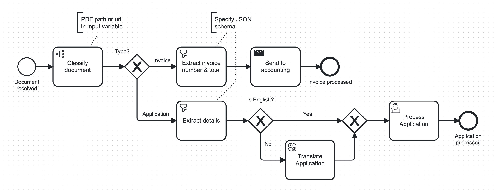

# BPM AI Connectors for Camunda 🤖

*Boost automation in your Camunda BPMN processes using pre-configured, task-specific AI solutions - wrapped in easy-to-use connectors 🚀*


[](https://holisticon.de/)
[](/LICENSE)


The connectors automate activities in business processes that previously required user tasks or specialized AI models, including:
* 🔍 **Information Extraction** from unstructured data such as emails, letters, documents, etc.
* ⚖  **Decision-Making** based on process variables
* ✍🏼 **Text Generation** for emails, letters, etc.
* 🌍 **Translation**

<figure>
  
  <figcaption>Example process using the Decide, Extract and Translate connectors.</figcaption>
</figure>

## 🆕 What's New in 1.0 
* Option to use small, efficient **AI models that can run 100% locally on the CPU** - no API key or expensive GPU needed!
* Multimodal support:
  * **audio** input (voice messages, call recordings, ...)
  * **image / document** input (document scans, PDFs, ...)
* Ultra slim docker image (**60mb** without local AI)
* Logging & Tracing support with [Langfuse](https://langfuse.com)

## 🔜 Upcoming
* higher quality local and API-based OCR
* support for local, open-access LLMs

---

## 🚀 How to Run

### ▶️ Quickstart with Wizard

Launch everything you need with a single command (cloud or automatically started local cluster):

```bash
bash <(curl -s https://raw.githubusercontent.com/holunda-io/camunda-8-connector-gpt/develop/wizard.sh)
```

On Windows, use WSL to run the command.

The Wizard will guide you through your preferences, create an .env file, and download and start the docker-compose.yml.

### 🖱 Use Element Templates in your Processes

After starting the connector workers in their runtime, you also need to make the connectors known to the Modeler in order to actually model processes with them:

* Upload the element templates from [/bpmn/.camunda/element-templates](/bpmn/.camunda/element-templates) to your project in Camunda Cloud Modeler
  * Click `publish` on each one
* Or, if you're working locally:
  * Place them in a `.camunda/element-templates` folder next to your .bpmn file
  * Or add them to the `resources/element-templates` directory of your Modeler ([details](https://docs.camunda.io/docs/components/modeler/desktop-modeler/element-templates/configuring-templates/#global-templates)).

### Manual Docker Configuration

Create an `.env` file (use `env.sample` as a template) and fill in your cluster information and your OpenAI API key:

```bash
OPENAI_API_KEY=<put your key here>

ZEEBE_CLIENT_CLOUD_CLUSTER-ID=<cluster-id>
ZEEBE_CLIENT_CLOUD_CLIENT-ID=<client-id>
ZEEBE_CLIENT_CLOUD_CLIENT-SECRET=<client-secret>
ZEEBE_CLIENT_CLOUD_REGION=<cluster-region>

# OR

ZEEBE_CLIENT_BROKER_GATEWAY-ADDRESS=zeebe:26500
```

Launch the connector runtime with a local zeebe cluster:

```bash 
docker compose --profile default --profile platform up -d
```

For Camunda Cloud, remove the platform profile.

To use the larger **inference** image that includes dependencies to run local AI model inference for decide, extract and translate, use the inference profile instead of default: 

```bash 
docker compose --profile inference --profile platform up -d
```

#### Available Image Tags

Two types of Docker images are available on [DockerHub](https://hub.docker.com/r/holisticon/bpm-ai-connectors-camunda-8):
* The lightweight (**~60mb** compressed) default image suitable for users only needing the OpenAI API (and other future API-based services)
  * Use `latest` tag (multiarch)
* The more heavy-weight (~500mb) inference image that contains all dependencies to run transformer AI models (and more) **locally on the CPU**, 
allowing you to use the `decide`, `extract` and `translate` connectors 100% locally without any API key needed
  * Use `latest-inference` tag (multiarch)
  
## 🕵 Logging & Tracing

Our connectors support logging traces of all task runs into [Langfuse](https://langfuse.com).

This allows for easy debugging, latency and cost monitoring, task performance analysis, and even curation and export of datasets from your past runs.

To configure tracing, add your keys to the `.env` file:

```bash
LANGFUSE_SECRET_KEY=<put your secret key here>
LANGFUSE_PUBLIC_KEY=<put your public key here>

# only if self-hosted:
#LANGFUSE_HOST=host:port
```

## 📚 Connector Documentation

* [Getting Started](docs/getting-started.md)
* [Connectors](docs/base-connectors.md)
* [Use Local Models](docs/local-models.md)

---

## 🛠️ Development & Project Setup

The connector workers are written in Python based on [pyzeebe](https://github.com/camunda-community-hub/pyzeebe).
They are a thin wrapper around the core logic and AI abstractions, 
which are independent of the specific workflow engine (or can even be integrated in a plain Python project directly) and placed 
in a separate repository: [bpm-ai](https://github.com/holunda-io/bpm-ai)

All connectors make use of feel expressions to flexibly map the task result into one or multiple result variables and/or define error expressions. 
Therefore, a feel engine is required - which is only available as a Scala implementation. 
To keep the runtime and Docker image overhead of needing an accompanying JVM app as low as possible,
[feel-engine-wrapper](/feel-engine-wrapper) is a small, native-compiled Quarkus server wrapping the [connector-sdk/feel-wrapper](https://github.com/camunda/connectors/tree/main/connector-sdk/feel-wrapper), which itself wraps the feel engine for use in connectors.


For convenience, both apps can be packaged into a single Docker image using the top-level Dockerfile or docker-compose.yml.

Alternatively, the Python connector runtime can be started directly (see below) and the feel-engine-wrapper has multiple Dockerfiles (native or JVM) in [src/main/docker](feel-engine-wrapper/src/main/docker).

### Build

#### Connectors 
```bash
cd bpm-ai-connectors-c8
```
Python 3.11 and Poetry 1.6.1 is required. 

The project itself also works with Python 3.12, but some dependencies of the bpm-ai[inference] extra don't compile in the python:3.12 docker image as of yet.

Install the dependencies:
```bash
poetry install
```
Run the connectors:
```bash
python -m bpm_ai_connectors_c8.main
```

Note that some dependencies are listed as dev dependencies which will be installed by `poetry install` as well. 
These are the full dependencies required to also run the parts of the application (and tests) referred to by _inference_.
Meaning, all heavy-weight dependencies for local model inference (torch, transformers, etc.) are included. 
Since poetry does not allow selectively installing extras of dependencies (only with environment markers), the Dockerfile 
only installs the main dependency block from the pyproject.toml and then manually installs the dependencies from 
[requirements.default.txt](bpm-ai-connectors-c8/requirements.default.txt) or [requirements.inference.txt](bpm-ai-connectors-c8/requirements.inference.txt),
depending on the image to build.

#### Feel Engine Wrapper
```bash
cd feel-engine-wrapper
```
Build native executable:
```bash
./mvnw package -Dnative
```
Run it:
```bash
./target/feel-engine-wrapper-runner
```

### Tests

Run integration test:

```bash
export ZEEBE_TEST_IMAGE_TAG=8.4.0 
export OPENAI_API_KEY=<put your key here> 
poetry run pytest
```

The tests will:
* spin up a Zeebe test engine using [pytest-zeebe](https://github.com/holunda-io/pytest-zeebe)
* start a mocked feel engine wrapper server
* deploy and run a small test process for each connector, using the actual OpenAI API

The CI/CD pipeline additionally runs these tests against the actual built Docker image before pushing the `latest` tag to Docker Hub.

### Docker Images
Build default image:

```bash
docker build -t bpm-ai-connectors-camunda-8:latest .
```

Build inference image:

```bash
docker build --build-arg="FLAVOR=inference" --build-arg="PYTHON_VERSION=3.11" -t bpm-ai-connectors-camunda-8:latest-inference .
```
---

## License

This project is developed under

[](/LICENSE)

## Sponsors and Customers

[](https://holisticon.de/)
