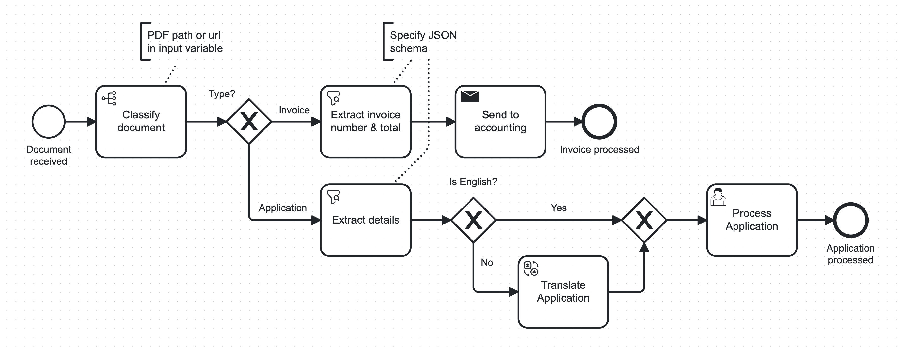

# BPM AI Connectors for Camunda 🤖

*Boost automation in your Camunda BPMN processes using pre-configured, task-specific AI solutions - wrapped in easy-to-use connectors 🚀*


[](https://marketplace.camunda.com/en-US/listing?q=Holisticon%20ai&page=1&locale=en-US)
[](https://holisticon.de/)
[](/LICENSE)


The connectors automate activities in business processes that previously required user tasks or specialized AI models, including:
* 🔍 **Information Extraction** from unstructured data such as emails, letters, documents, etc.
* ⚖  **Decision-Making** based on process variables
* ✍🏼 **Text Generation** for emails, letters, etc.
* 🌍 **Translation**

Use API-based LLMs and AI services like OpenAI GPT-4 or go **100% local with open-access LLMs and AI models** from [HuggingFace Hub](https://huggingface.co/models), 
local OCR with tesseract and local audio transcription with Whisper. All running CPU-only, no GPU required.

<figure>
  
</figure>

### 🆕 What's New
* Use **100% local LLMs** with zero configuration!
* Anthropic Claude 3 model options (all support images/PDFs)
* New GPT-4 Turbo (supports images/PDFs)
* Use any OpenAI compatible LLM API
* Option to use small **AI models running 100% locally on the CPU** - no API key or GPU needed!
  * Curated models known to work well, just select from dropdown
  * Or use any compatible model from [HuggingFace Hub](https://huggingface.co/models)
* Multimodal input:
  * **Audio** (voice messages, call recordings, ...) using local or API-based transcription
  * **Images / Documents** (document scans, PDFs, ...) using local or API-based OCR or multimodal AI models
* Use files from Amazon S3 or Azure Blob Storage
* Logging & Tracing support with [Langfuse](https://langfuse.com)

### 🔜 Upcoming
* higher quality local OCR

---

# Table of Contents

* 🚀 [How to Run](#-how-to-run)
  * ▶️ [Quicksstart](#-quickstart-with-wizard)
  * [Manual Setup](#manual-docker-configuration)
* 📚 [Connector Documentation](#-connector-documentation)
  * [Getting Started](docs/getting-started.md)
  * [Connectors](docs/base-connectors.md)
  * [Use Local LLMs](docs/local-llms.md)
  * [Use Local Specialized Models](docs/local-models.md)
  * [Use Images & Audio](docs/multi-modality.md)
  * [Example Usecases & HowTos](docs/usecases.md)
* 🕵 [Logging & Tracing](#-logging--tracing)
* 🛠️ [Development & Project Setup](docs/development.md)

---

## 🚀 How to Run

### ▶️ Quickstart with Wizard

Launch everything you need with a single command (cloud or automatically started local cluster):

```bash
bash <(curl -s https://raw.githubusercontent.com/holunda-io/bpm-ai-connectors-camunda-8/main/wizard.sh)
```

On Windows, use WSL2.

The Wizard will guide you through your preferences, create an .env file, and download and start the docker-compose.yml.

### 🖱 Use Element Templates in your Processes

After starting the connector workers in their runtime, you also need to make the connectors known to the Modeler in order to actually model processes with them:

* Upload the element templates from [/bpmn/.camunda/element-templates](/bpmn/.camunda/element-templates) to your project in Camunda Cloud Modeler
  * Click `publish` on each one
* Or, if you're working locally:
  * Place them in a `.camunda/element-templates` folder next to your .bpmn file
  * Or add them to the `resources/element-templates` directory of your Modeler ([details](https://docs.camunda.io/docs/components/modeler/desktop-modeler/element-templates/configuring-templates/#global-templates)).
  * Or let the wizard copy them automatically, if your Modeler is found in a typical location

### 🔧 Manual Docker Configuration

Create an `.env` file (use `env.sample` as a template) and fill in your cluster information and your OpenAI API key:

```bash
OPENAI_API_KEY=<put your key here>

ZEEBE_CLIENT_CLOUD_CLUSTER_ID=<cluster-id>
ZEEBE_CLIENT_CLOUD_CLIENT_ID=<client-id>
ZEEBE_CLIENT_CLOUD_CLIENT_SECRET=<client-secret>
ZEEBE_CLIENT_CLOUD_REGION=<cluster-region>

# OR

ZEEBE_CLIENT_BROKER_GATEWAY_ADDRESS=zeebe:26500
```

Create a data and .cache directory for the connector volume

```bash
mkdir ./data ./.cache
```
and launch the connector runtime with a local zeebe cluster:

```bash 
docker compose --profile platform up -d
```

For Camunda Cloud, remove the platform profile.

To use the **inference** extension container that includes local AI model inference implementations for decide, extract and translate, as well as local OCR, additionally use the inference profile: 

```bash 
docker compose --profile inference --profile platform up -d
```

#### Available Images

Two types of Docker images are available on [DockerHub](https://hub.docker.com/r/holisticon/bpm-ai-connectors-camunda-8):
* The main image suitable for users only needing the Anthropic/OpenAI and Azure/Amazon APIs (and other future API-based services)
* An optional inference image that contains all dependencies to run local LLMs and other AI models **locally on the CPU**

## 📚 Connector Documentation

Learn how to effectively use the connectors in your processes, use fully local AI, different input modalities like PDFs, images, or audio files, and more.

* [Getting Started](docs/getting-started.md)
* [Connectors](docs/base-connectors.md)
* [Use Local LLMs](docs/local-llms.md)
* [Use Local Specialized Models](docs/local-models.md)
* [Use Images & Audio](docs/multi-modality.md)
* [Example Usecases & HowTos](docs/usecases.md)

---

## 🕵 Logging & Tracing

Our connectors support logging traces of all task runs into [Langfuse](https://langfuse.com).

This allows for easy debugging, latency and cost monitoring, task performance analysis, and even curation and export of datasets from your past runs.

To configure tracing, add your keys to the `.env` file:

```bash
LANGFUSE_SECRET_KEY=<put your secret key here>
LANGFUSE_PUBLIC_KEY=<put your public key here>

# only if self-hosted:
#LANGFUSE_HOST=host:port
```

---

## 🛠️ Development & Project Setup
Read more [here](docs/development.md).

---

## License

This project is developed under

[](/LICENSE)

## Sponsors and Customers

[](https://holisticon.de/)
